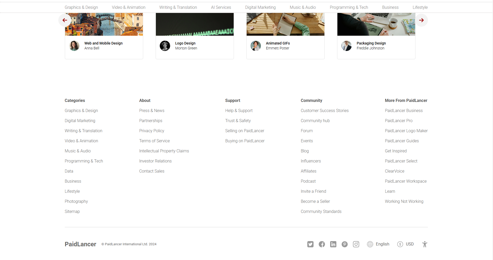
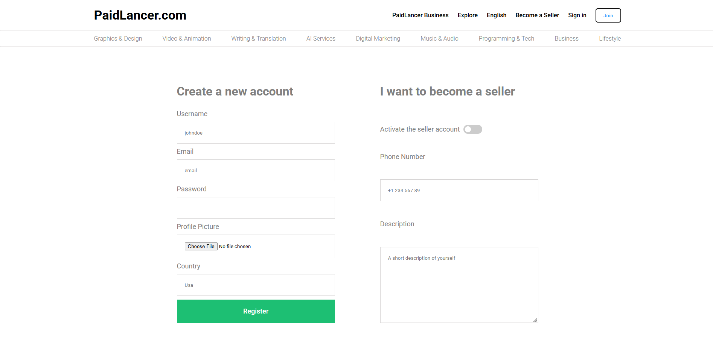

# 💼 Paidlancer – Freelance Marketplace Platform  

## 📌 Overview  
Paidlancer is a full-stack freelance marketplace that connects clients and freelancers, offering secure authentication, job postings, bidding, messaging, and seamless payment transactions.  

### 🚀 Why Paidlancer?  
✔️ Simplifies hiring by enabling efficient talent discovery through profile search  
✔️ Provides a secure and transparent platform for payments and job management  
✔️ Enhances collaboration with real-time messaging and a responsive user interface  
✔️ Ensures scalability with a robust backend for seamless user experience  

--- 

---

## 📸 Demo  
### 🎬 User Interface  
  
  
  
  
  
  
 

## 🛠️ Technologies Used  
- **Frontend:** ReactJS, JavaScript, CSS, Bootstrap  
- **Backend:** Node.js, Express.js  
- **Database:** MongoDB  
- **Authentication:** JWT (JSON Web Token)  
- **APIs:** REST API  
- **Other:** WebSockets for real-time communication 

---

## 🚀 Features  

### 🎓 For Freelancers  
🔹 **Create & Manage Profiles** – Showcase skills, experience, and portfolio  
🔹 **Browse & Bid on Jobs** – Search for projects and submit proposals  
🔹 **Secure Payments** – Receive payments securely through integrated payment gateway  
🔹 **Real-time Messaging** – Communicate with clients instantly  

### 🎩 For Clients  
🔹 **Post Jobs** – Describe project requirements and set budgets  
🔹 **Hire Talent** – Browse freelancer profiles and select the best fit  
🔹 **Monitor Work Progress** – Track project milestones and updates  
🔹 **Secure Transactions** – Ensure smooth and secure payments  

---

## 📩 Contact & Support  
📧 **Email:** [bhartirounak@gmail.com](mailto:bhartirounak@gmail.com)  
🔗 **GitHub:** [https://github.com/rounakbharti](https://github.com/rounakbharti)  
🌐 **Project Repository:** [Paidlancer](https://github.com/rounakbharti/Paidlancer)  

💡 *For any issues, feel free to open a GitHub issue!* 🚀  
